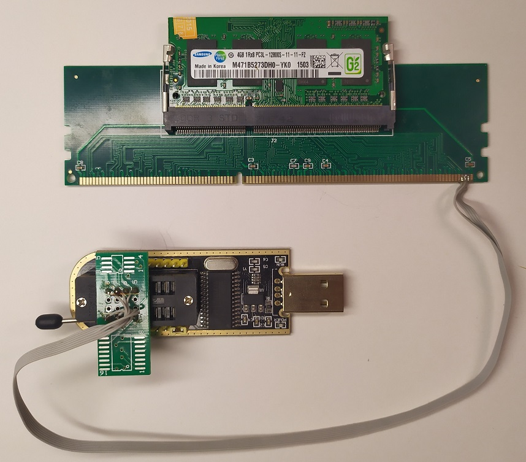
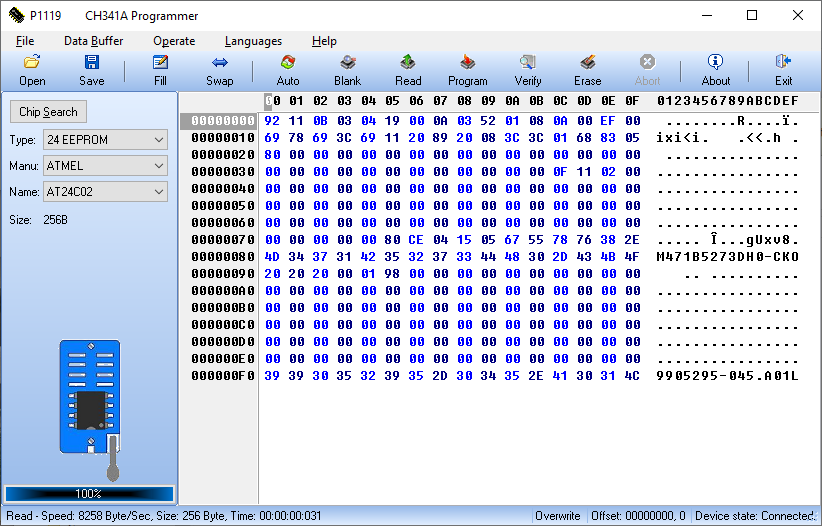

# spd-tool

spd-tool - это утилита, предназначенная для редактирования конфигурации модулей памяти DDR3. Конфигурация DDR3 хранится в энергонезависимой памяти, распаянной на модуле SO-DIMM. Это EEPROM семейства 24C02 объемом 256 байт, её содежимое описано в документе JEDEC Standard No. 21-C

Модули памяти DDR3 SO-DIMM поддерживают различные напряжения питания: 1.5V, 1.35V и 1.25V. Некоторые модули могут поддерживать сразу несколько напряжений питания (как правило 1.5V и 1.35V). Во время включения материнская плата по шите I2C опрашивает конфигурацию установленных модулей и принимает решение о запуске. Не все материнские платы могут запуститься с модулем, расчитанным на пониженное напряжение.

Экспериментально установлено, что сброс пониженных напряжений в SPD помогает некоторым системам запуститься. Информация об напряжинии питания содержится в байте 6 (начиная с нуля). Но в случае редактирования необходимо также подправить контрольную сумму в байтайх 126-127.

Утилита spd-tool предназначена для редактирования содержимого SPD
- сброс и установка поддержки пониженного напряжения
- коррекция контрольной суммы.

## Работа с дампом памяти SPD

Вывести детальную информацию об SPD
```
spd-tool -i dump.bin -v

         00 01 02 03 04 05 06 07 08 09 0a 0b 0c 0d 0e 0f
00000000 92 11 0b 03 04 19 00 0a 03 52 01 08 0a 00 ef 00
00000010 69 78 69 3c 69 11 20 89 20 08 3c 3c 01 68 83 05
00000020 80 00 00 00 00 00 00 00 00 00 00 00 00 00 00 00
00000030 00 00 00 00 00 00 00 00 00 00 00 00 0f 11 02 00
00000040 00 00 00 00 00 00 00 00 00 00 00 00 00 00 00 00
00000050 00 00 00 00 00 00 00 00 00 00 00 00 00 00 00 00
00000060 00 00 00 00 00 00 00 00 00 00 00 00 00 00 00 00
00000070 00 00 00 00 00 80 ce 04 15 05 67 55 78 76 38 2e
00000080 4d 34 37 31 42 35 32 37 33 44 48 30 2d 43 4b 4f
00000090 20 20 20 00 01 98 00 00 00 00 00 00 00 00 00 00
000000a0 00 00 00 00 00 00 00 00 00 00 00 00 00 00 00 00
000000b0 00 00 00 00 00 00 00 00 00 00 00 00 00 00 00 00
000000c0 00 00 00 00 00 00 00 00 00 00 00 00 00 00 00 00
000000d0 00 00 00 00 00 00 00 00 00 00 00 00 00 00 00 00
000000e0 00 00 00 00 00 00 00 00 00 00 00 00 00 00 00 00
000000f0 39 39 30 35 32 39 35 2d 30 34 35 2e 41 30 31 4c

SPD:
CRC Coverage:                   0...116 (1)
Bytes total:                    256 bytes (1)
Bytes used:                     176 bytes (2)
Revision:                       1.0
DRAM Device Type:               DDR3 SDRAM (11)
Module Type:                    SO-DIMM (width = 67.6 mm nom) (3)
Total SDRAM capacity:           4096 Mbits (4)
Bank Address Bits:              8 bits (0)
Row Address Bits:               15 bits (3)
Column Address Bits:            10 bits (1)
Module Minimum Nominal Voltage: 1.5 V operable (0)
SDRAM Device Width:             16 (2)
Number of Ranks:                2 (1)
Primary bus width:              64 (3)
Bus width extension:            0 (0)
Module Capacity:                4096 MBytes
Module Part Number:             M471B5273DH0-CKO
CRC:                            0x2e38 OK
```

Некоторые no-name модули памяти могут содержать некорректную контрольную сумму. Об этом будет просигнализировано в детальной информации. Исправить контрольную сумму можно следующим образом:
```
spd-tool -i dump.bin --fix-crc -o dump.bin
```

Выставить флаг 1.35V (DDR3 -> LP-DDR3)
```
spd-tool -i dump_1.5v.bin --set-lp -o dump_1.35v.bin
```

Сбросить флаг 1.35V (LP-DDR3 -> DDR3)
```
spd-tool -i dump_lp-ddr.bin --reset-lp -o dump_ddr.bin
```

Перед работой с дампом SPD, его нужно каким-либо образом получить. Далее приведены несколько скособов, как это можно сделать в домашних условиях.

## Чтение SPD с помощью ОС Linux

Если есть в наличии машина под управлением Linux, считать SPD возможно получится стандартными утилитами:
1. Загружаем драйвер I2C
2. Детектируем адаптер шины SMBus
3. Детектируем адреса устройств на шине SMBus (EEPROM будут иметь стартовый адрес 0x50...0x57)
4. Считываем содержимое Dump SPD payload

Пример:
```
$ sudo modprobe i2c-dev                                                                                                                                             
$ sudo modprobe i2c-i801
$ sudo i2cdetect -l
...
i2c-0   smbus           SMBus I801 adapter at f040              SMBus adapter
...
$ sudo i2cdetect 0
...
50: 50 -- 52 -- -- -- -- -- -- -- -- -- -- -- -- --
...
$ sudo i2cdump 0 0x52 b
     0  1  2  3  4  5  6  7  8  9  a  b  c  d  e  f    0123456789abcdef
00: 92 11 0b 03 04 21 00 09 03 11 01 08 0a 00 fe 00    ?????!.??????.?.
10: 69 78 69 30 69 11 18 81 20 08 3c 3c 00 f0 83 05    ixi0i??? ?<<.???
20: 00 00 00 00 00 00 00 00 00 00 00 00 00 00 00 00    ................
30: 00 00 00 00 00 00 00 00 00 00 00 00 0f 11 05 00    ............???.
40: 00 00 00 00 00 00 00 00 00 00 00 00 00 00 00 00    ................
50: 00 00 00 00 00 00 00 00 00 00 00 00 00 00 00 00    ................
60: 00 00 00 00 00 00 00 00 00 00 00 00 00 00 00 00    ................
70: 00 00 00 00 00 07 5d 00 19 19 00 00 00 00 4c ee    .....?].??....L?
80: 47 52 31 36 30 30 53 33 36 34 4c 31 31 2f 38 47    GR1600S364L11/8G
90: 00 00 01 01 00 00 ff ff 4a aa 00 00 0c 23 09 02    ..??....J?..?#??
a0: 00 00 00 bc 00 00 00 00 00 00 00 00 00 00 00 00    ...?............
b0: ff ff ff ff ff ff ff ff ff ff ff ff ff ff ff ff    ................
c0: ff ff ff ff ff ff ff ff ff ff ff ff ff ff ff ff    ................
d0: ff ff ff ff ff ff ff ff ff ff ff ff ff ff ff ff    ................
e0: ff ff ff ff ff ff ff ff ff ff ff ff ff ff ff ff    ................
f0: ff ff ff ff ff ff ff ff ff ff ff ff ff ff ff ff    ................
```

Однако, записать SPD подобными утилитами скорее всего не получится (в моем случае это не сработало).

## Чтение и запись SPD с помощью программатора

Самый надежный способ - использовать программатор, например, на базе чипа CH341:
1. считать дамп SPD из EEPROM
2. сохранить дамп в бинарный файл
3. отредактировать бинарный дамп
4. открыть дамп в программаторе
5. записать дамп SPD в EEPROM

Остается проблема - как подключить программатор к микросхеме памяти, расположенной на плате ОЗУ? Идея состоит в том, что выводы EEPROM разведены на разъемы модуля SO-DIMM. Поэтому, самый простой способ - приобрести адаптер SO-DIMM -> DIMM и подпаяться программатором к выводам DIMM DDR3:
* ```117``` - ```SA0```
* ```118``` - ```SCL```
* ```119``` - ```SA2```
* ```236``` - ```VDDSPD```
* ```237``` - ```SA1```
* ```238``` - ```SDA```



После подключения к шине I2C можно воспользоваться программатором для чтения и записи SPD. Для этого необходимо установить драйвер CH341A, а также скачать один из вариантов ПО для данного программатора.



## Чтение и запись SPD с помощью утилиты spd-tool

Для упрощения работы с EEPROM в утилиту spd-tool была добавлена возможность рабты с USB драйвером через сервисную библиотеку ```CH341DLLA64.DLL``` из состава драйвера CH341A. В настоящее время поддерживается только 64-битная версия Windows драйвера.

Пример
```
spd-tool -d --reset-lp
```

Опция ```-d``` определяет источник входных и выходных данных, как устройство "USB программатор". При этом можно таже указать опции ```-i,-o```. Обе опции будут определять файл, в который будет ЗАПИСАН дамп SPD до и после подификации соответсвенно.

```
spd-tool -d --reset-lp -i source.bin -o modified.bin
```
